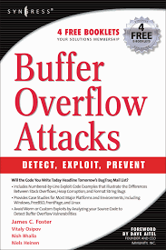
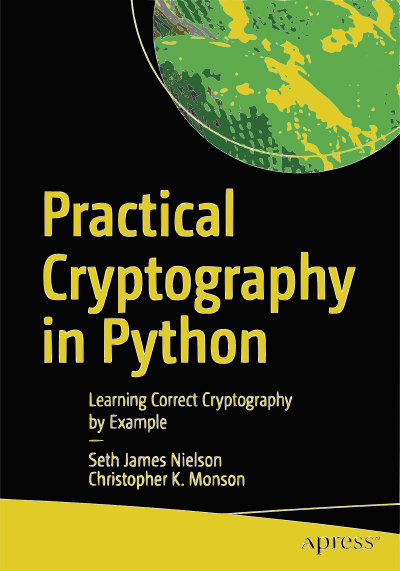
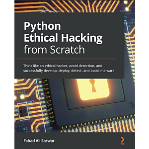
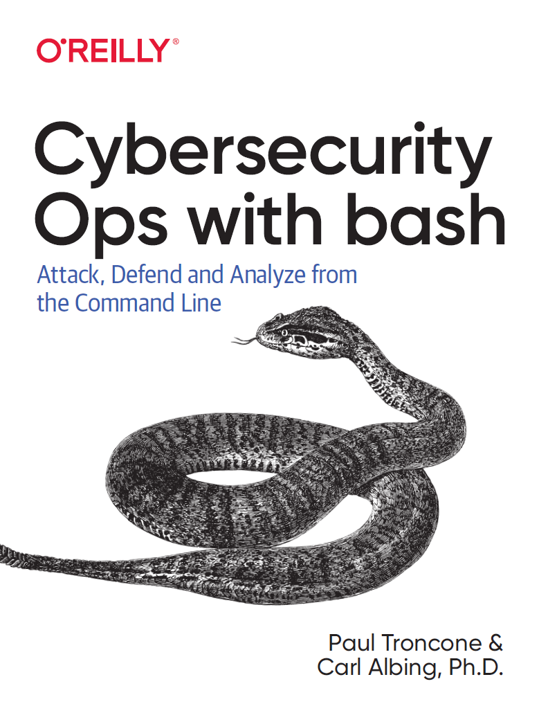
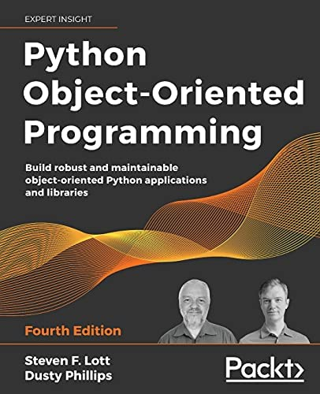
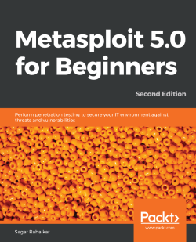
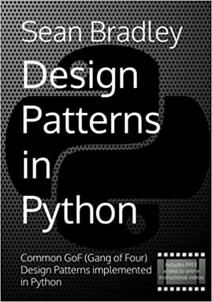
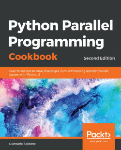

<h1>Reading now</h1>

<table>
    <tr>
      <td align="center" width="200">
        
        <b>
          Buffer Overflow Attacks: Detect, Exploit, Prevent
        </b>
      </td>
      <td align="center" width="200">
        
         
        <b>
            The Art of 64-Bit Assembly
        </b>
      </td>
      <td align="center" width="200">
        
         
        <b>
            FOR610: Reverse-Engineering Malware: Malware Analtsis Tools and Techniques
        </b>
      </td>
    </tr>
</table>

<h1>My book library</h1>

<table>
  <tr>
      <td align="center" width="200">
        
        <b>
          Practical Cryptography in Python: Learning Correct Cryptography by Example
        </b>
      </td>
      <td align="center" width="200">
        
        <b>
            Serious Cryptography: A Practical Introduction to Modern    Encryption
        </b>
      </td>
        <td align="center" width="200">
            
            <b>
                Python Ethical Hacking from Scratch: Think like an ethical hacker, ...
            </b>
        </td>
      <tr>
        <td align="center" width="200">
            
            <b>
                Offensive Security Certified Professional
            </b>
        </td>
        <td align="center" width="200">
            
            <b>
                SEC573: Automating Information Security with Python
            </b>
        </td>
        <td align="center" width="200">
            
            <b>
                SEC617: Wireless Penetration Testing and Ethical Hacking
            </b>
        </td>
      </tr>
        <td align="center" width="200">
            
            <b>
                Cybersecurity Ops with bash: Attack, Defend, and Analyze from the Command Line 1st Edition 
            </b>
        </td>
        <td align="center" width="200">
            
            <b>
                Python Object-Oriented Programming - Fourth Edition 
            </b>
        </td>
        <td align="center" width="200">
            
            <b>
                Metasploit 5.0 for Beginners - Second Edition
            </b>
        </td>
    </tr>
    <tr>
        <td align="center" width="200">
            
            <b>
                Antivirus Bypass Techniques
            </b>
        </td>
        <td align="center" width="200">
            
            <b>
                Design Patterns in Python: Common GOF
            </b>
        </td>
        <td align="center" width="200">
            
            <b>
                Web-сервер глазами хакера. 3-е изд.
            </b>
        </td>
    </tr>
    <tr>
        <td align="center" width="200">
            
            <b>
                Компьютерные сети 5-е издание
            </b>
        </td>
        <td align="center" width="200">
            
            <b>
                Python Parallel Programming Cookbook - Second Edition 
            </b>
        </td>
        <td align="center" width="200">
            
            <b>
                Linux Administration Cookbook 
            </b>
        </td>
    </tr>
    <tr>
        <td align="center" width="200">
            
            <b>
                Социальная инженерия и социальные хакеры
            </b>
        </td>
    </tr>

</table>  
