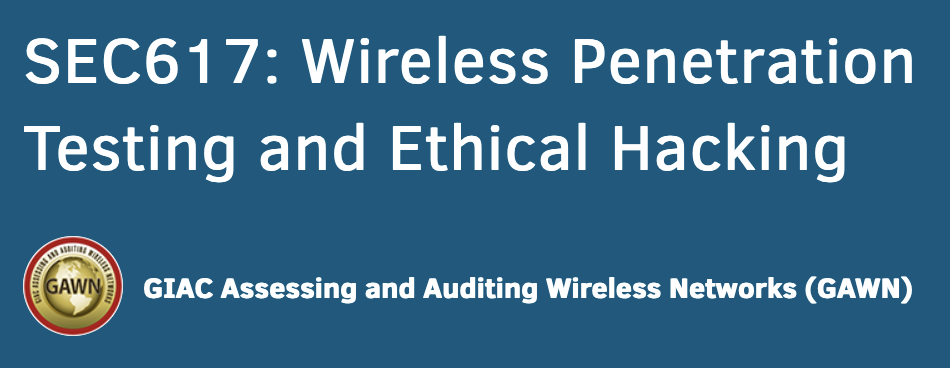

<h1>My book library</h1>
<table>

<tr>
    <td>
        
        <b>
Threat Modeling: Designing for Security
        </b>
    </td>
    <td>
        
        <b>
            Certified Kubernetes Security Specialist (Cks) Study Guide: In-Depth Guidance and Practice
        </b>
    </td>
    <td>
        
        <b>
            Building Secure and Reliable Systems: Best Practices for Designing, Implementing, and Maintaining Systems
        </b>
    </td>
</tr>

<tr>
    <td>
        
        <b>
            Container Security: Fundamental Technology Concepts that Protect Containerized Applications
        </b>
    </td>
    <td>
        
        <b>
            Designing Data-Intensive Applications: The Big Ideas Behind Reliable, Scalable, and Maintainable Systems
        </b>
    </td>
    <td>
        
        <b>
            ГОСТ 56930 Разработка Безопасного Програмного Обеспечения
        </b>
    </td>
</tr>

<tr>
    <td>
        
        

            <b>
                Essential SQLAlchemy: Mapping Python to Databases
            </b>
        

    </td>
    <td>
        
        

            <b>
                Black Hat GraphQL: Attacking Next Generation APIs
            </b>
        

    </td>
    <td>
        
        

            <b>
                Black Hat Go
            </b>
        

    </td>
</tr>

<tr>
    <td>
        
        

            <b>Чистая архитектура. Искусство разработки программного
                обеспечения</b>
        

    </td>
    <td>
        
        

            <b>Принципы юнит-тестирования</b>
        

    </td>
    <td>
        
        

            <b>SEC554: Blockchain and Smart Contract Security</b>
        

    </td>
</tr>

<tr>
    <td align="center" width="100">
        
        

            <b>SEC573: Automating Information Security with Python</b>
        

    </td>
    <td align="center" width="200">
        
        

            <b>SEC617: Wireless Penetration Testing and Ethical Hacking</b>
        

    </td>
    <td align="center" width="200">
        
        

            <b>Mastering Ethereum: Building Smart Contracts and DApps</b>
        

    </td>
</tr>

<tr>
    <td align="center" width="200">
        
        

            <b>Threat Hunting with Elastic Stack: Solve security challenges with integrated prevention, detection, and response</b>
        

    </td>
    <td align="center" width="200">
        
        

            <b>Solidity Programming Essentials: A beginner's guide to build smart contracts for Ethereum and blockchain</b>
        

    </td>
    <td align="center" width="200">
        
        

            <b>Network Protocols for Security Professionals: Probe and identify network-based vulnerabilities and safeguard against network protocol breaches</b>
        

    </td>
</tr>
<tr>
    <td align="center" width="200">
        
        

            <b>Network Forensics: Privacy and Security</b>
        

    </td>
    <td align="center" width="200">
        
        

            <b>SEC503.3 Application Protocols and Traffic Analysis</b>
        

    </td>
    <td align="center" width="200">
        
        

            <b>SAP Security and Risk Management</b>
        

    </td>
</tr>
<tr>
    <td align="center" width="200">
        
        

            <b>Practical Cryptography in Python: Learning Correct Cryptography by Example</b>
        

    </td>
    <td align="center" width="200">
        
        

            <b>Serious Cryptography: A Practical Introduction to Modern Encryption</b>
        

    </td>
    <td align="center" width="200">
        
        

            <b>Python Ethical Hacking from Scratch: Think like an ethical hacker</b>
        

    </td>
    <tr>
    </tr>
    <td align="center" width="200">
        
        

            <b>Cybersecurity Ops with bash: Attack, Defend, and from the Command Line 1st Edition</b>
        

    </td>
    <td align="center" width="200">
        
        

            <b>Python Object-Oriented Programming - Fourth Edition</b>
        

    </td>
    <td align="center" width="200">
        
        

            <b>Metasploit 5.0 for Beginners - Second Edition</b>
        

    </td>
</tr>
<tr>
    <td align="center" width="200">
        
        

            <b>Социальная инженерия и социальные хакеры</b>
        

    </td>
    <td align="center" width="200">
        
        

            <b>Practical Network Scanning</b>
        

    </td>
    <td align="center" width="200">
        
        

            <b>Mastering Regular Expressions</b>
        

    </td>
</tr>
<tr>
    <td align="center" width="200">
        
        

            <b>Antivirus Bypass Techniques</b>
        

    </td>
    <td align="center" width="200">
        
        

            <b>Design Patterns in Python: Common GOF</b>
        

    </td>
    <td align="center" width="200">
        
        

            <b>Web-сервер глазами хакера. 3-е изд.</b>
        

    </td>
</tr>
<tr>
    <td align="center" width="200">
        
        

            <b>Компьютерные сети 5-е издание</b>
        

    </td>
    <td align="center" width="200">
        
        

            <b>Python Parallel Programming Cookbook - Second Edition</b>
        

    </td>
    <td align="center" width="200">
        
        

            <b>Linux Administration Cookbook</b>
        

    </td>
</tr>

</table>
